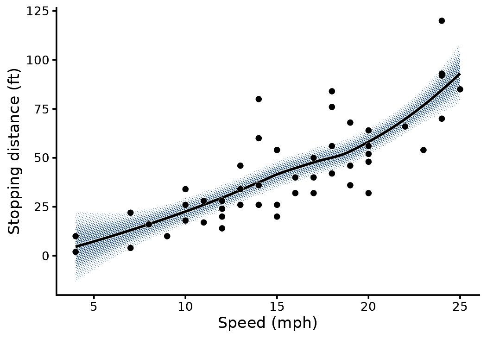
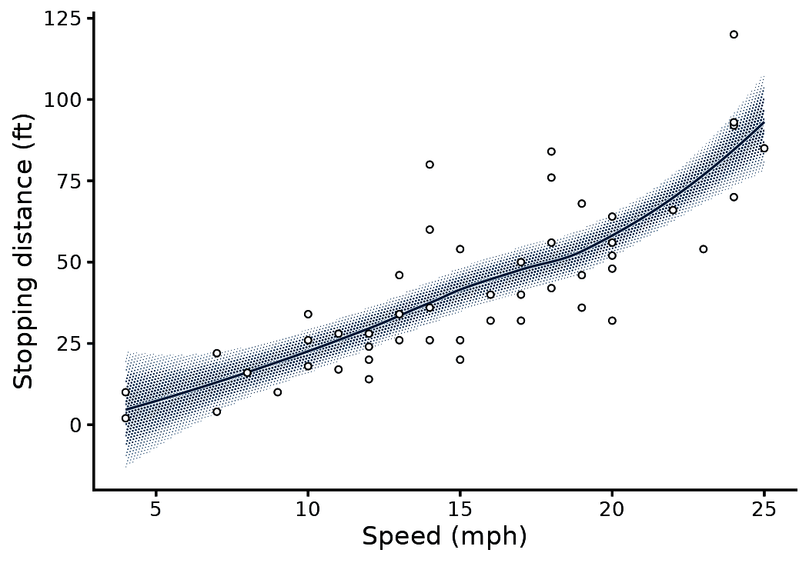
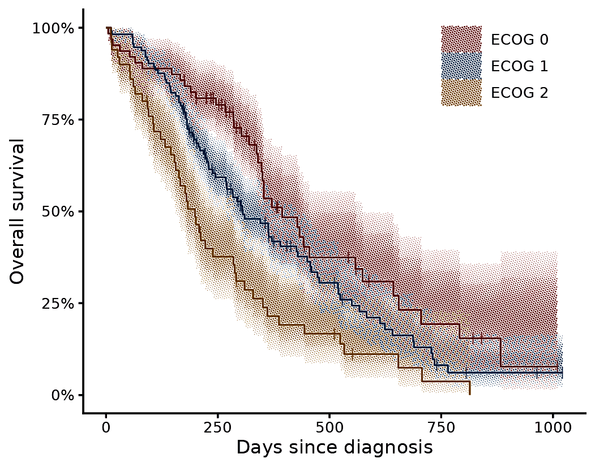
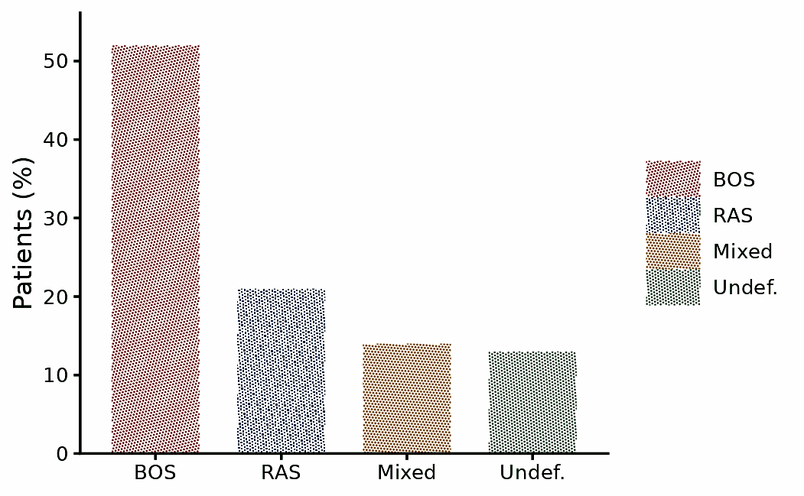
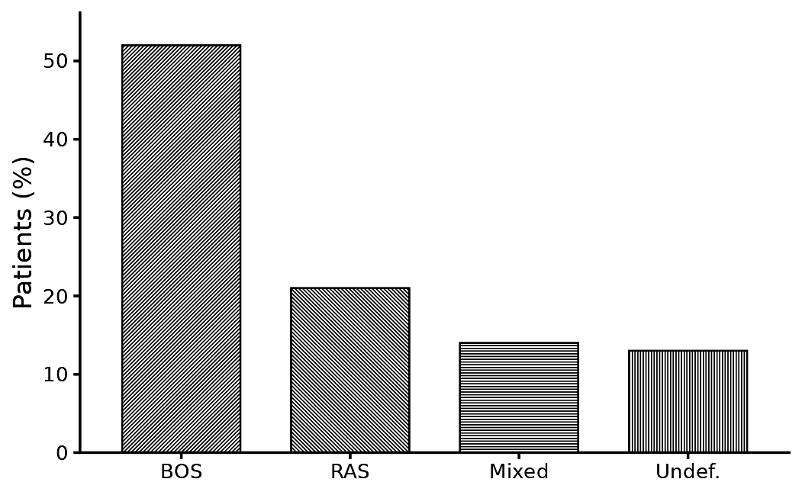

# Halftone fills for journal figures

A halftone prints tone as dots of varying size on a fixed lattice.
gghalftone applies this to ggplot2 fills at draw time. The lattice has a
physical pitch in millimetres, so a figure saved at 89 mm and at 183 mm
gets the same screen.

Use it for journal figures. A confidence band stays legible in
greyscale, overlapping intervals do not hide one another, and a bar
chart can be decoded from its hatching alone.

## Screen a whole plot

[`halftone_plot()`](https://kinelhu.github.io/gghalftone/reference/halftone_plot.md)
takes a finished plot and returns it printed. It screens every filled
layer, draws a paper hairline under every line that crosses a screen,
and adds the theme modifier. Any argument of
[`with_halftone()`](https://kinelhu.github.io/gghalftone/reference/with_halftone.md)
passes through.

``` r

m <- loess(dist ~ speed, cars, span = 0.9)
nd <- data.frame(speed = seq(4, 25, length.out = 80))
pr <- predict(m, nd, se = TRUE)
nd$fit <- pr$fit; nd$lo <- pr$fit - 1.96 * pr$se.fit; nd$hi <- pr$fit + 1.96 * pr$se.fit

p <- ggplot(nd, aes(speed)) +
  geom_ribbon(aes(ymin = lo, ymax = hi), fill = "steelblue") +
  geom_line(aes(y = fit), linewidth = 0.6) +
  geom_point(data = cars, aes(speed, dist), size = 1) +
  labs(x = "Speed (mph)", y = "Stopping distance (ft)") + theme_classic(base_size = 8)

halftone_plot(p)
```



The treatment follows the geom. Ribbons, areas, densities, bars, tiles,
polygons, sf geometries, violins, boxplots and smooths are screened.
Lines, paths, steps, contours and points are haloed, but only where a
screen sits under them. Text, error bars, rugs and reference lines are
left alone, and so is any geom it does not recognise.

It screens the fill and nothing else, so line weights, point shapes and
fill colours stay as you set them. The rest of this vignette composes
the same figure layer by layer, which is what to do when the figure is
built for the screen from the start.

## Screen a confidence band

[`with_halftone()`](https://kinelhu.github.io/gghalftone/reference/with_halftone.md)
wraps any filled layer. The layer draws as usual, and its fill is
replaced by a screen in the fill colour, clipped to the shape.

``` r

m <- loess(dist ~ speed, cars, span = 0.9)
nd <- data.frame(speed = seq(4, 25, length.out = 80))
pr <- predict(m, nd, se = TRUE)
nd$fit <- pr$fit; nd$lo <- pr$fit - 1.96 * pr$se.fit; nd$hi <- pr$fit + 1.96 * pr$se.fit

ggplot(nd, aes(speed)) +
  with_halftone(geom_ribbon(aes(ymin = lo, ymax = hi), fill = halftone_inks[["blue"]])) +
  with_halo(geom_line(aes(y = fit), colour = halftone_inks[["blue"]], linewidth = 0.35)) +
  geom_point(data = cars, aes(speed, dist), shape = 21, fill = "white", size = 0.8, stroke = 0.3) +
  labs(x = "Speed (mph)", y = "Stopping distance (ft)") +
  theme_classic(base_size = 8) + theme_halftone()
```



Three package defaults apply here:

- The band’s tone follows the likelihood of the estimate across the
  interval. Tone is full on the fitted line and 0.146 at the 95% limit.
- [`with_halo()`](https://kinelhu.github.io/gghalftone/reference/with_halo.md)
  draws a 0.09 mm paper stroke under the line, so the line stays
  readable where it crosses dots.
- [`theme_halftone()`](https://kinelhu.github.io/gghalftone/reference/theme_halftone.md)
  adds only what a halftone needs to the theme it follows: a paper
  ground with no gridlines under the screen, legend keys large enough to
  show a screen, and the ink palette. Sizes and fonts stay with
  `theme_classic()`.

## Plot survival with three strata

The data are the North Central Cancer Treatment Group lung cancer trial
(Loprinzi et al. 1994), distributed as
[`survival::lung`](https://rdrr.io/pkg/survival/man/lung.html).

Groups that share a panel are printed on one lattice. Where two bands
overlap, their dots alternate, so both inks stay visible.

``` r

library(survival)
fit <- survfit(Surv(time, status) ~ ph.ecog, data = subset(lung, ph.ecog < 3))
s <- km_steps(fit); levels(s$strata) <- paste("ECOG", levels(s$strata))
cens <- km_censor(fit); levels(cens$strata) <- levels(s$strata)

ggplot(s, aes(time, group = strata)) +
  with_halftone(geom_ribbon(aes(ymin = lo, ymax = hi, fill = strata))) +
  with_halo(geom_step(aes(y = surv, colour = strata), linewidth = 0.35)) +
  geom_point(data = cens, aes(time, surv, colour = strata), shape = "|", size = 1.6) +
  scale_y_continuous(labels = scales::percent) +
  guides(colour = "none") +
  labs(x = "Days since diagnosis", y = "Overall survival", fill = NULL) +
  theme_classic(base_size = 8) + theme_halftone() + theme(legend.position = "inside", legend.position.inside = c(0.82, 0.86))
```



[`km_steps()`](https://kinelhu.github.io/gghalftone/reference/km_steps.md)
converts a `survfit` object into the step-shaped frame that the ribbon
needs.
[`km_censor()`](https://kinelhu.github.io/gghalftone/reference/km_steps.md)
returns the censor marks and
[`km_risk()`](https://kinelhu.github.io/gghalftone/reference/km_steps.md)
the number at risk. On ggplot2 4.0 the modifier sets the ink palette as
the default.

## Screen bars

For geoms whose groups tile the plane (bars, areas, polygons, tiles),
each fill also gets its own screen angle and shape. The legend keys show
both, and the figure survives greyscale printing.

``` r

d <- data.frame(g = factor(c("BOS", "RAS", "Mixed", "Undef."), c("BOS", "RAS", "Mixed", "Undef.")), n = c(52, 21, 14, 13))
ggplot(d, aes(g, n, fill = g)) +
  with_halftone(geom_col(width = 0.7)) +
  scale_y_continuous(expand = expansion(c(0, 0.08))) +
  labs(x = NULL, y = "Patients (%)", fill = NULL) +
  theme_classic(base_size = 8) + theme_halftone()
```



For a one-ink figure, map the `screen` aesthetic and set
`shape = "line"`.

``` r

ggplot(d, aes(g, n, screen = g)) +
  with_halftone(geom_col(width = 0.7, fill = "black", colour = "black", linewidth = 0.25), shape = "line") +
  scale_screen_discrete(guide = "none") +
  scale_y_continuous(expand = expansion(c(0, 0.08))) +
  labs(x = NULL, y = "Patients (%)") +
  theme_classic(base_size = 8) + theme_halftone()
```



## Save

[`ggsave_journal()`](https://kinelhu.github.io/gghalftone/reference/theme_halftone.md)
saves at a journal column width. The file extension selects the format:
PNG for proofs, TIFF for submission, PDF for a vector file in which
every dot is a path.

``` r

ggsave_journal("fig1.pdf", p, "single", height = 62)
ggsave_journal("fig1.tiff", p, "double", height = 90)
halftone_proof(p)   # final-size render plus a 4x crop of the panel centre
```

## Defaults

- Pitch is 0.35 mm (73 lines per inch). Coarser pitches read as a dot
  pattern. Finer pitches read as a flat tint.
- No feature is smaller than 0.09 mm (0.25 pt), the minimum line weight
  in journal artwork guidelines (Nature Portfolio; Elsevier). Light tone
  becomes sparse dots at the minimum size.
- The tone profile follows the geometry: flat where the interior is the
  value (bars, areas, maps), likelihood for intervals, a soft vignette
  for densities.
- One ink register applies across figure types, so a set of figures
  looks consistent.
- Overlapping groups share one lattice. A fill’s alpha becomes screen
  coverage, and the output holds no partial transparency.

## References

- Loprinzi, C. L., Laurie, J. A., Wieand, H. S., et al. (1994).
  Prospective evaluation of prognostic variables from patient-completed
  questionnaires. North Central Cancer Treatment Group. *Journal of
  Clinical Oncology*, 12(3), 601-607.
  <https://doi.org/10.1200/JCO.1994.12.3.601>. Distributed as
  [`survival::lung`](https://rdrr.io/pkg/survival/man/lung.html).
- Nature Portfolio. Formatting guide: figures.
  <https://www.nature.com/nature/for-authors/formatting-guide>
- Elsevier. Artwork and media instructions.
  <https://www.elsevier.com/about/policies-and-standards/author/artwork-and-media-instructions>
