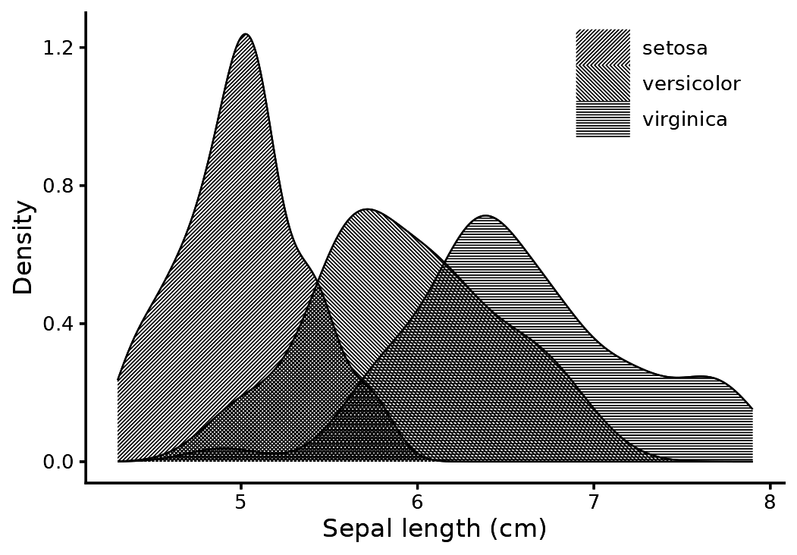
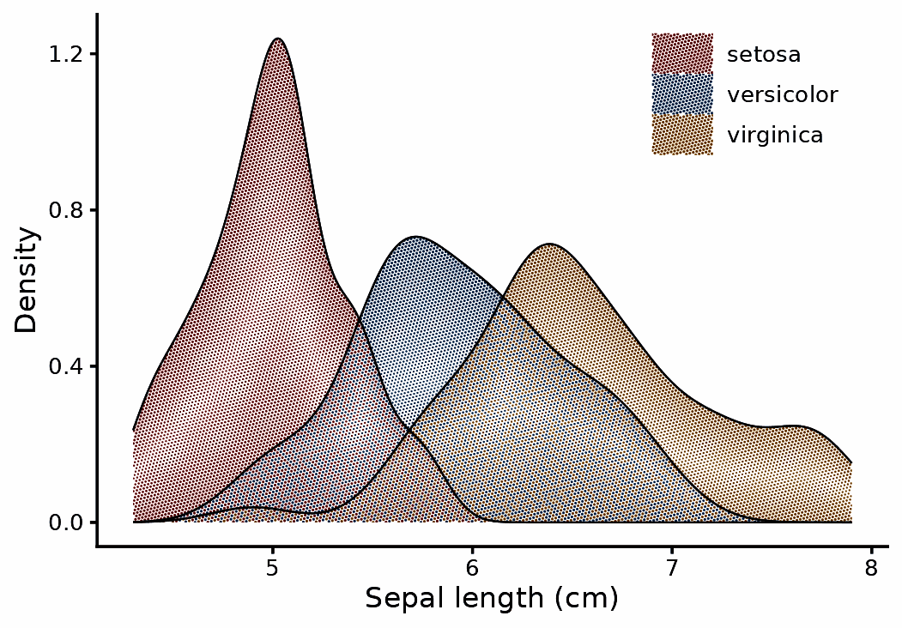
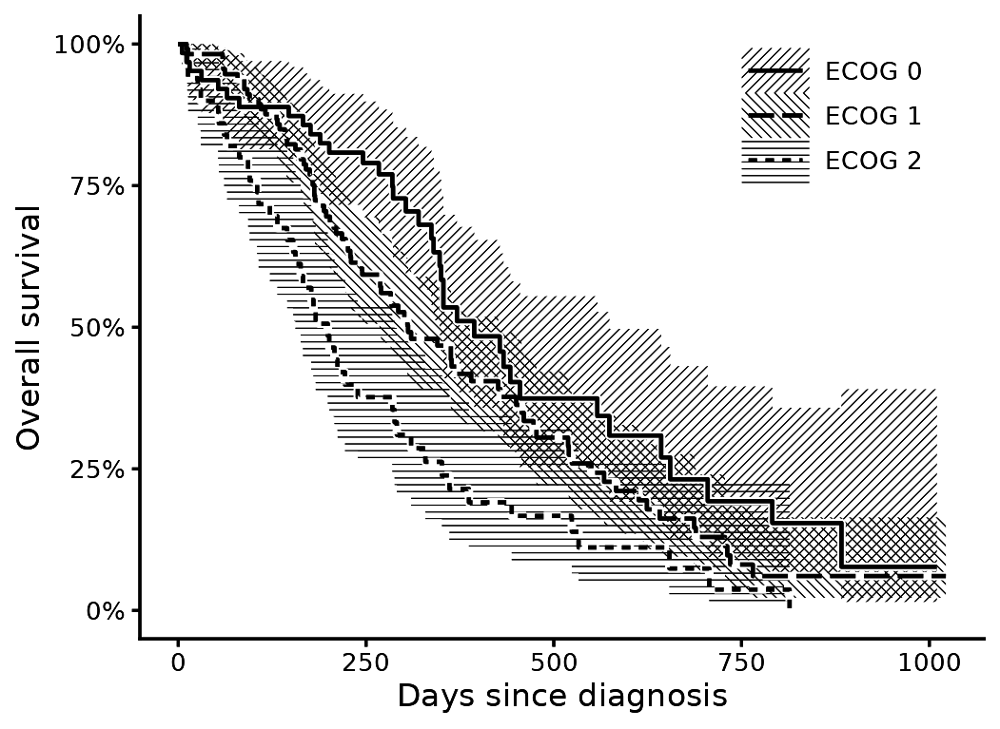
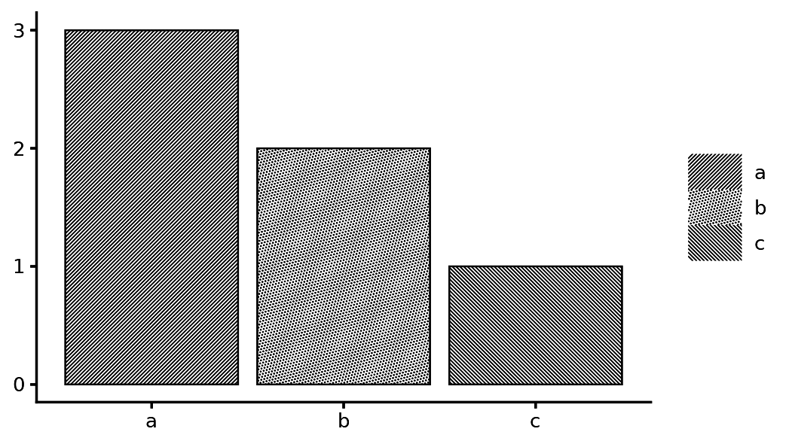
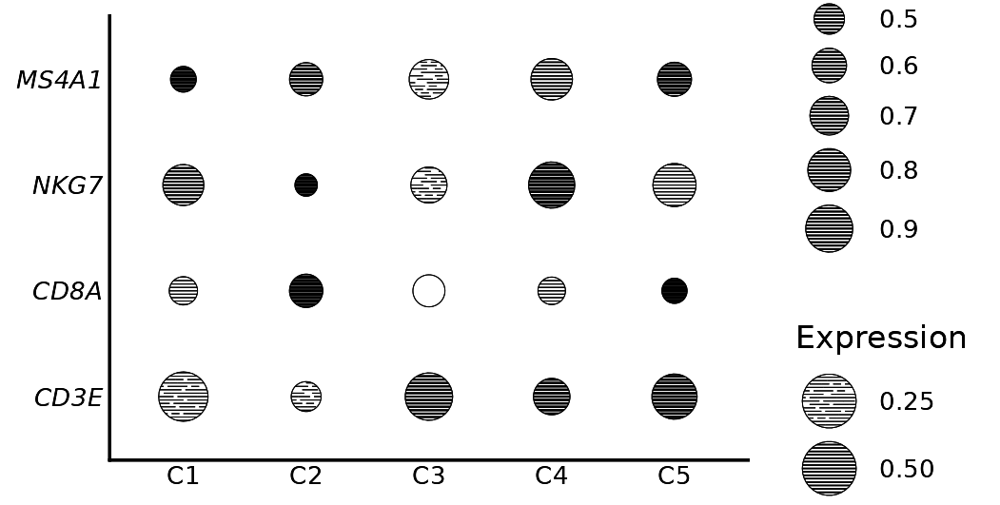

# One ink: screens, hatching and the screen aesthetic

Many journals print in black, and colour figures are converted. A figure
that does not depend on colour is safer. The `screen` aesthetic maps a
discrete variable to a screen: a lattice angle, a dot shape, and a hatch
angle for line screens. Angle alone distinguishes three groups. The
default recipe also varies the shape.

## Densities

``` r

ggplot(iris, aes(Sepal.Length, screen = Species, group = Species)) +
  with_halftone(geom_density(fill = "black", linewidth = 0.25), shape = "line") +
  scale_screen_discrete(name = NULL) +
  labs(x = "Sepal length (cm)", y = "Density") +
  theme_classic(base_size = 8) + theme_halftone() + theme(legend.position = "inside", legend.position.inside = c(0.82, 0.85), legend.key.size = unit(5, "mm"))
```



Where two densities overlap, the hatches cross. With dots instead of
lines, overlapping groups share one lattice.

``` r

ggplot(iris, aes(Sepal.Length, fill = Species, group = Species)) +
  with_halftone(geom_density(linewidth = 0.25)) +
  labs(x = "Sepal length (cm)", y = "Density", fill = NULL) +
  theme_classic(base_size = 8) + theme_halftone() + theme(legend.position = "inside", legend.position.inside = c(0.82, 0.85))
```



## Three intervals in one ink

The data are the lung cancer trial of Loprinzi et al. (1994). Hatched
intervals are drawn as a hairline at the printable minimum.

Three overlapping hatches make a dense mesh, and a thin line inside it
is hard to follow. Four settings fix that together: a coarser pitch (0.7
mm) so the mesh is open, a wider halo (0.2 mm) so the line gets its own
channel, a heavier line (0.5), and long dashes, because a short dash
disappears into the hatch.

``` r

library(survival)
fit <- survfit(Surv(time, status) ~ ph.ecog, data = subset(lung, ph.ecog < 3))
s <- km_steps(fit); levels(s$strata) <- paste("ECOG", levels(s$strata))

ggplot(s, aes(time, group = strata, screen = strata)) +
  with_halftone(geom_ribbon(aes(ymin = lo, ymax = hi), fill = "black"), shape = "line", pitch = 0.7) +
  with_halo(geom_step(aes(y = surv, linetype = strata), linewidth = 0.5), width = 0.2) +
  scale_screen_manual(values = c(45, 135, 0), name = NULL) +
  scale_linetype_manual(values = c("solid", "62", "22"), name = NULL) +
  scale_y_continuous(labels = scales::percent) +
  labs(x = "Days since diagnosis", y = "Overall survival") +
  theme_classic(base_size = 8) + theme_halftone() + theme(legend.position = "inside", legend.position.inside = c(0.82, 0.84), legend.key.size = unit(5, "mm"))
```



## Screen specifications

A screen specification is a string of the form
`"angle|shape|tone|line_angle"`. A bare number is an angle.
[`scale_screen_manual()`](https://kinelhu.github.io/gghalftone/reference/scale_screen_discrete.md)
accepts your own specifications. You can mix hatching and dots in one
layer.

Legend keys are a sample of the screen at its own pitch and strip width,
so a key reads at the same density as the fill it stands for.

``` r

d <- data.frame(g = c("a", "b", "c"), n = c(3, 2, 1))
ggplot(d, aes(g, n, screen = g)) +
  with_halftone(geom_col(fill = "black", colour = "black", linewidth = 0.25)) +
  scale_screen_manual(values = c("45|line", "15|circle", "135|line"), name = NULL) +
  labs(x = NULL, y = NULL) + theme_classic(base_size = 8) + theme_halftone()
```



## Dot plots in one ink

[`geom_spot()`](https://kinelhu.github.io/gghalftone/reference/geom_spot.md)
draws one disc per point. The ink density inside the disc is the value.
With `shape = "line"` the discs are hatched, and `screen` applies per
group.

``` r

dp <- expand.grid(gene = c("CD3E", "CD8A", "NKG7", "MS4A1"), cluster = paste0("C", 1:5))
set.seed(1); dp$expr <- runif(nrow(dp)); dp$pct <- runif(nrow(dp), 0.3, 1)
ggplot(dp, aes(cluster, gene, tone = expr, size = pct)) +
  geom_spot(shape = "line", colour = "black") +
  scale_tone_continuous(name = "Expression") + scale_radius(range = c(1, 2.2), name = "Expressing") +
  labs(x = NULL, y = NULL) + theme_minimal() + theme_classic(base_size = 8) + theme_halftone() + theme(axis.ticks = element_blank()) + theme(axis.text.y = element_text(face = "italic"))
```



## References

- Loprinzi, C. L., Laurie, J. A., Wieand, H. S., et al. (1994).
  Prospective evaluation of prognostic variables from patient-completed
  questionnaires. North Central Cancer Treatment Group. *Journal of
  Clinical Oncology*, 12(3), 601-607.
  <https://doi.org/10.1200/JCO.1994.12.3.601>. Distributed as
  [`survival::lung`](https://rdrr.io/pkg/survival/man/lung.html).
