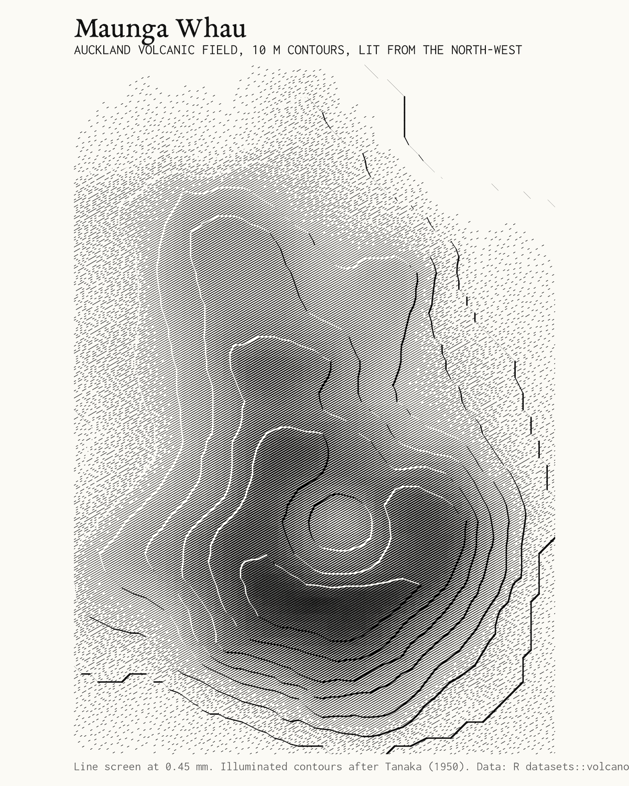

# gghalftone


Halftone fills for ggplot2. The package places dots or hatch lines at draw time on a lattice with a physical pitch in millimetres. A figure saved at 89 mm and at 183 mm gets the same screen, not a scaled one. Overlapping groups are printed on one lattice so that every group stays visible.


*A Kaplan-Meier plot at journal size: 89 mm, 600 dpi, 7 pt text. Three 95% confidence bands drawn with `with_halftone(geom_ribbon())`, step curves with `with_halo()`, censor marks and a risk table from `km_steps()`, `km_censor()` and `km_risk()`.*

## Usage

```r
library(gghalftone)

# Screen the fill of any layer: ribbons, areas, bars, densities, polygons, sf.
s <- km_steps(survfit(Surv(time, status) ~ ecog, data = d))
ggplot(s, aes(time, group = strata)) +
  with_halftone(geom_ribbon(aes(ymin = lo, ymax = hi, fill = strata))) +
  with_halo(geom_step(aes(y = surv, colour = strata))) +
  theme_halftone()

# Screen a gridded field. Colour scales apply to the field; dots inherit the colour.
ggplot(field, aes(x, y, z = value, colour = value)) + geom_halftone()

# Draw one tone disc per point.
ggplot(markers, aes(cluster, gene, tone = expression, size = pct)) + geom_spot() + scale_tone() + scale_radius()

# Encode a variable as screen angle and dot shape instead of colour.
ggplot(f, aes(x, y, z = z, screen = series)) + geom_halftone() + scale_screen_discrete()

# Draw a line screen.
ggplot(vol, aes(x, y, z = z)) + geom_halftone(shape = "line", angle = 30)
```


*Left to right, top to bottom: the Kaplan-Meier plot above, a smooth with its confidence band, three densities, a choropleth, the same Kaplan-Meier plot in one ink, a blue-noise stipple. All are produced by `prototypes/gallery2.R` with package defaults.*

## Defaults

The defaults encode these rules. Each one was chosen by comparing renders at 600 dpi.

- **Pitch is 0.35 mm** (73 lines per inch). At 0.6 mm the screen reads as a dot pattern. At 0.25 mm it reads as a flat tint and takes five times longer to draw.
- **Tone is continuous.** Dot area follows tone exactly. Set `levels = k` to quantise and dither, for example `levels = 1` for a stipple.
- **No feature is smaller than 0.09 mm** (0.25 pt), the usual journal minimum. Below that tone, cells are dithered at the minimum size, so light regions become sparse dots or broken hairlines rather than grey pixels.
- **The tone profile follows the geometry.** Bars, areas, polygons and maps are flat, because their interior is the value. Ribbons follow the likelihood of the estimate: full tone on the estimate, 0.146 at a 95% limit. Densities and violins get a soft vignette so that overlapping groups stay legible. A mapped `screen` is always flat.
- **Colour is never the only encoding.** On bars, areas, polygons and tiles, each fill also gets its own screen angle and shape. The figure survives greyscale printing.
- **No lattice axis is horizontal or vertical.** The hex lattice is rotated 15 degrees and the square lattice 45 degrees, so bar tops and step plateaus do not alias against a row of dots.
- **Overlapping groups share one lattice.** Two inks alternate in a checkerboard. Three inks use the hex lattice's three-colouring, so no two neighbouring dots share an ink. Beyond three inks, use hatch angles or facets.
- **Alpha becomes coverage.** A fill with 30% alpha prints as a 30% screen. Nothing translucent reaches the page.
- **Screens are clipped to the fill.** Dots never overhang an outline.
- **Line screens are flat.** Hatching has constant weight and a hard edge. A tapered hatch reads as fringe.

## Black and white


Three strata in one ink. The `screen` aesthetic sets a hatch angle per stratum; line type distinguishes the estimates.


Maunga Whau. One `shape = "line"` layer for the surface, and `with_relief(geom_contour())` for illuminated contours after Tanaka: lit segments in paper, shaded segments in ink.

## Theme and export

`theme_halftone()` is a journal theme: Liberation Sans, 7 to 8 pt text, bold panel tags placed in the layout margin, no gridlines. `style = "editorial"` is a page register for 120 to 183 mm plates, with cream paper, Garamond titles and monospace labels.

`ggsave_journal("fig.pdf", p, "double")` saves at 183 mm. The file extension selects the format: PNG or TIFF at 600 dpi, or vector PDF. `halftone_proof()` renders a plot at final size and a magnified crop. `theme_halftone(palette = "process")` uses press colours made of one or two process plates.



## Status

Prototype. The API of `geom_halftone()`, `geom_spot()`, `with_halftone()`, `with_halo()`, `with_relief()`, the `screen` and `tone` aesthetics, `km_steps()` and `theme_halftone()` is considered stable. Every export has a help page. Start with `?with_halftone`.
