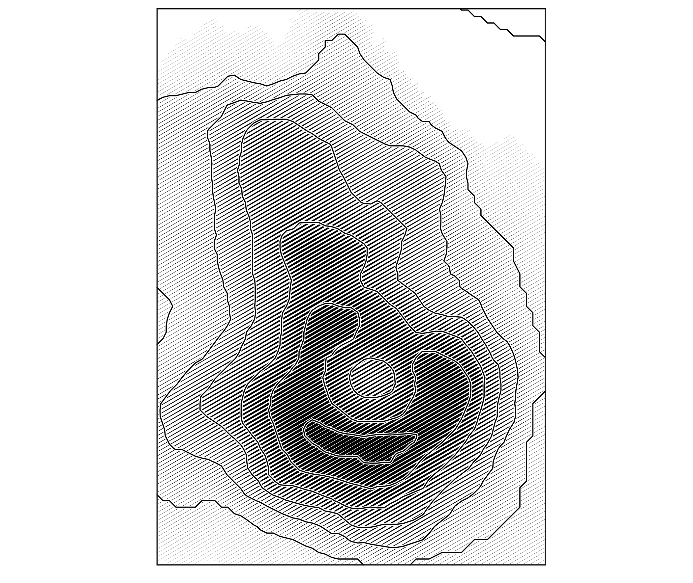
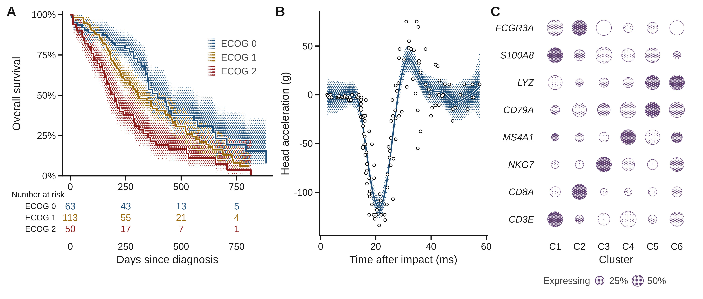
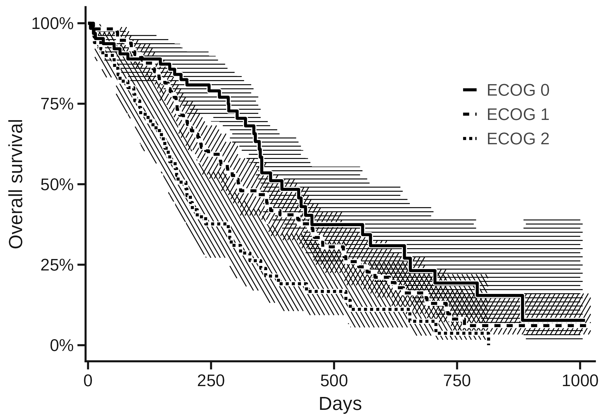
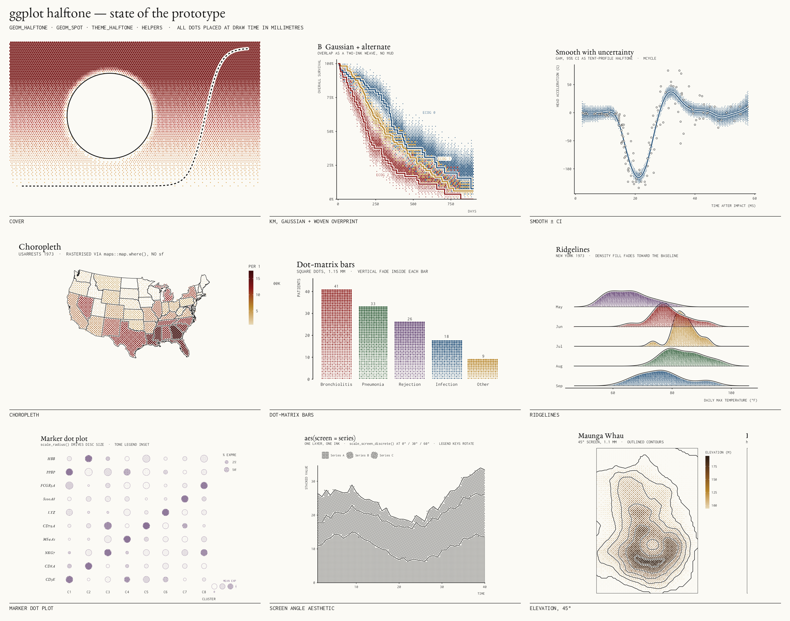

# gghalftone



Print-style halftone screens for ggplot2. Dots (or hatch lines) are placed at **draw time on a lattice with a physical pitch in millimetres**, so a figure saved at 89 mm and at 183 mm has the same screen, not a scaled one. Overlapping groups are overprinted (woven), never hidden.



*Figure 1 as it would go to a journal — 183 mm, 600 dpi, 7 pt. A: Kaplan–Meier with 95 % CI as a gaussian-profile hex halftone (`with_halftone(geom_ribbon())`). B: GAM ± CI. C: scRNA-style marker dot plot (`geom_spot`, radius = % expressing, tone = mean expression).*

## What it does

```r
library(gghalftone)

# 1. any filled layer -> halftone fill (ribbons, areas, bars, densities, polygons, sf)
s <- km_steps(survfit(Surv(time, status) ~ ecog, data = d))            # step-ready frame: time, surv, lo, hi, strata
ggplot(s, aes(time, group = strata)) +
  with_halftone(geom_ribbon(aes(ymin = lo, ymax = hi, fill = strata))) +   # tone fades from the estimate to the CI limit
  with_halo(geom_step(aes(y = surv, colour = strata))) +                   # hairline of paper under the line
  theme_halftone()                                                         # also makes the ink palette the default

# 2. a continuous field -> dot screen; colour scales apply to the field, dots inherit
ggplot(field, aes(x, y, z = value, colour = value)) + geom_halftone()   # 0.6 mm hex, continuous tone

# 3. per-point tone discs
ggplot(markers, aes(cluster, gene, tone = expression, size = pct)) + geom_spot() + scale_tone() + scale_radius()

# 4. colour-free encodings: screen angle x dot shape x tone, up to ~6 distinguishable
ggplot(f, aes(x, y, z = z, screen = series)) + geom_halftone() + scale_screen_discrete()

# 5. line screens (engraving) -- continuous tone or constant-weight hatching, never faded bands
ggplot(vol, aes(x, y, z = z)) + geom_halftone(shape = "line", angle = 30)
```


## Design rules learned the hard way

- **Dots fade, lines don't.** Dot halftones want a gaussian tone profile (peak on the estimate, soft edge). Line screens want constant weight and a hard edge; tapered strokes read as fringe.
- **Profile follows geometry.** Ribbons fade from the estimate (`tone = "centre"`); densities and violins get a soft vignette; bars, areas, polygons and maps are flat, because there the interior *is* the value. A mapped `screen` is a pattern, and patterns are flat.
- **Continuous tone by default.** Dot area follows tone exactly; `levels = k` quantises and dithers for a stipple. Nothing below 2 % tone is drawn.
- **No lattice axis horizontal or vertical.** 15° on the hex lattice (default), 45° on square, so bar tops and step plateaus never alias against a row of dots.
- **Overlap is a panel property.** Groups sharing a lattice must be overprinted (`overlap = "overprint"`, woven by default) or the last group erases the others. Flat screens hide this best, which is why they are not the default.
- **Physical pitch or nothing.** 0.45–0.6 mm at 600 dpi reads as continuous tone; 0.9–1.2 mm reads as a pattern. Journal figures want the former; editorial covers want the latter.
- **Angle alone distinguishes three screens.** Beyond that, vary shape and tone (`scale_screen_discrete()` does), or add a second ink.
- **Bayer for graded tone, blue noise for binary stipple, Floyd–Steinberg for photographs.**
- **Overlap weave.** Two inks → checkerboard; three → the hex lattice's exact 3-colouring, so each ink gets a third of the cells with no same-ink neighbours; more → phase cycling. Region identity is readable to three inks, tolerable at four, gone at five — switch to hatch angles or facet beyond that.
- **Alpha is ink coverage.** `with_halftone()` folds a fill's alpha into tone (a 30 % alpha fill prints as a 30 % screen) and strips it from the ink; nothing translucent reaches the page.
- **The wrapper clips.** Screens are cut to the exact fill region with a grid clipping path, so dots never overhang an outline.

## Black and white



Three strata, one ink: crosshatch angles from `aes(screen = )` on the ribbon, line type on the estimates.


Maunga Whau from `geom_contour()` plus one `shape = "line"` layer.

## Theme

`theme_halftone()` defaults to a journal style (Liberation Sans, absolute 7–8 pt sizes, bold tags, sentence case, no gridlines); `style = "editorial"` gives the cream-paper/Garamond/monospace look used for the cover-style pieces. `ggsave_journal(p, "double")` saves at 183 mm and 600 dpi.



## Status

Prototype. API considered stable for `geom_halftone()`, `geom_spot()`, `with_halftone()`, the screen aesthetic and the theme. Known gaps: no `scale_tone()` legend yet (use `halftone_tone_legend()`); `geom_spot()` ignores `shape = "line"` and `screen`.
