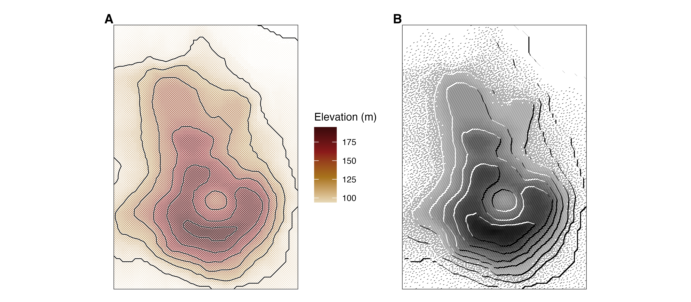
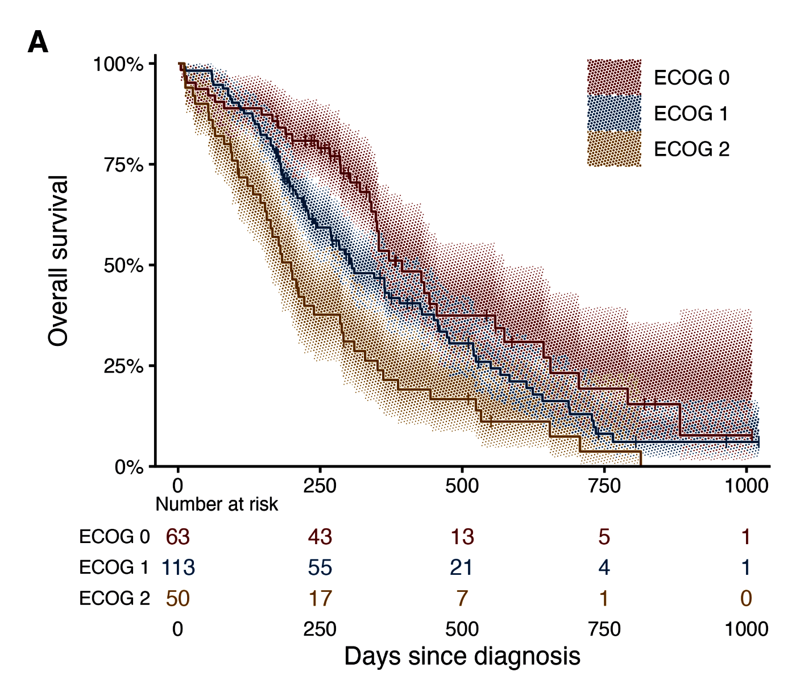
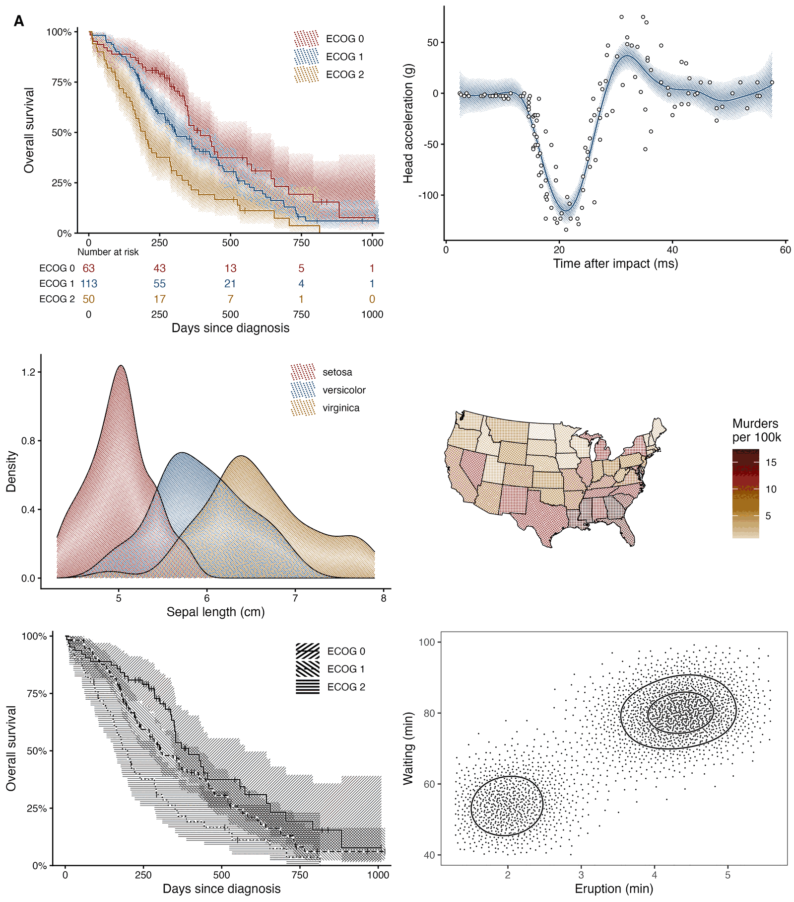
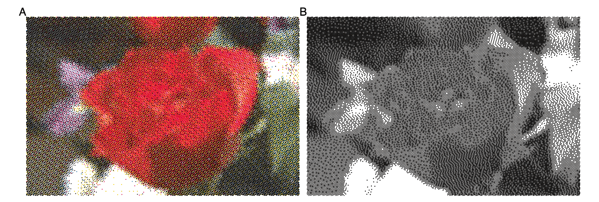
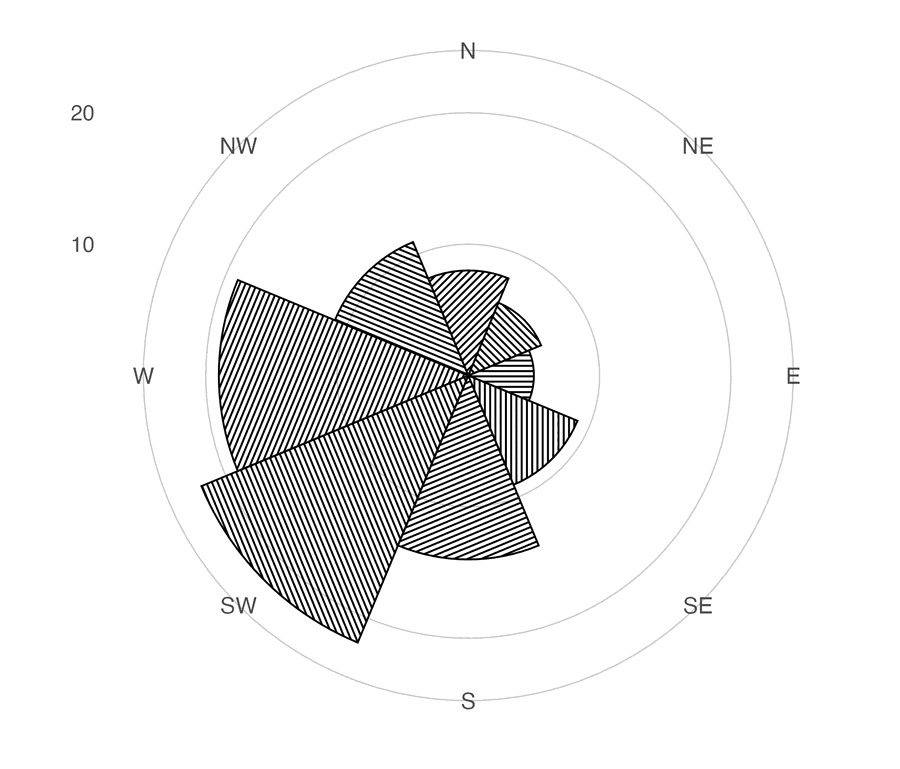
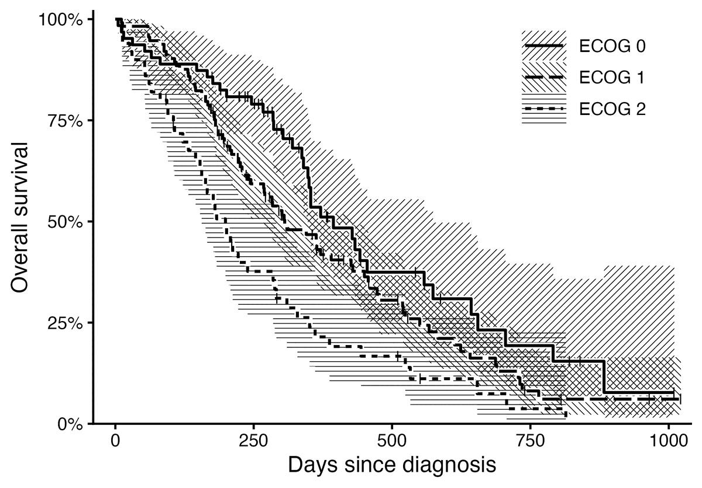

# gghalftone



Halftone fills for ggplot2. The package places dots or hatch lines at draw time on a lattice with a physical pitch in millimetres. This is what separates it from [ggfx](https://ggfx.data-imaginist.com), whose `with_*()` filters run on the rasterised layer, so their dot size is in pixels and changes with output size. A figure saved at 89 mm and at 183 mm gets the same screen, not a scaled one. Overlapping groups are printed on one lattice so that every group stays visible.



*A Kaplan-Meier plot of the North Central Cancer Treatment Group lung cancer data (Loprinzi et al. 1994) at journal size: 89 mm, 600 dpi, `theme_classic(base_size = 8)`. Three 95% confidence bands drawn with `with_halftone(geom_ribbon())`, step curves with `with_halo()`, censor marks and a risk table from `km_steps()`, `km_censor()` and `km_risk()`.*

## Usage

```r
library(gghalftone)

# Screen the fill of any layer: ribbons, areas, bars, densities, polygons, sf.
s <- km_steps(survfit(Surv(time, status) ~ ecog, data = d))
ggplot(s, aes(time, group = strata)) +
  with_halftone(geom_ribbon(aes(ymin = lo, ymax = hi, fill = strata))) +
  with_halo(geom_step(aes(y = surv, colour = strata))) +
  theme_classic() + theme_halftone()

# Simple features work like any other layer.
ggplot(counties) + with_halftone(geom_sf(aes(fill = rate)))

# Screen a gridded field. Colour scales apply to the field; dots inherit the colour.
ggplot(field, aes(x, y, z = value, colour = value)) + geom_halftone()

# Draw one tone disc per point.
ggplot(markers, aes(cluster, gene, tone = expression, size = pct)) + geom_spot() + scale_tone() + scale_radius()

# Encode a variable as screen angle and dot shape instead of colour.
ggplot(f, aes(x, y, z = z, screen = series)) + geom_halftone() + scale_screen_discrete()

# Draw a line screen.
ggplot(vol, aes(x, y, z = z)) + geom_halftone(shape = "line", angle = 30)
```



*Left to right, top to bottom: the Kaplan-Meier plot above, a smooth with its confidence band, three densities, a choropleth, the same Kaplan-Meier plot in one ink, a blue-noise stipple. All are produced by `prototypes/gallery2.R` with package defaults.*

## Defaults

The defaults encode these rules. Each one was chosen by comparing renders at 600 dpi.

- **Pitch is 0.35 mm** (73 lines per inch). At 0.6 mm the screen reads as a dot pattern. At 0.25 mm it reads as a flat tint and takes five times longer to draw.
- **Tone is continuous.** Dot area follows tone exactly. Set `levels = k` to quantise and dither with an ordered (Bayer 1973), blue-noise (Ulichney 1993) or error-diffusion (Floyd and Steinberg 1976) matrix, for example `levels = 1` for a stipple.
- **No feature is smaller than 0.09 mm** (0.25 pt), the minimum line weight in journal artwork guidelines (Nature Portfolio; Elsevier). Below that tone, cells are dithered at the minimum size, so light regions become sparse dots or broken hairlines rather than grey pixels.
- **The tone profile follows the geometry.** Bars, areas, polygons and maps are flat, because their interior is the value. Ribbons follow the likelihood of the estimate: full tone on the estimate, 0.146 at a 95% limit. Densities and violins get a soft vignette so that overlapping groups stay legible. A mapped `screen` is always flat.
- **Colour is never the only encoding.** On bars, areas, polygons and tiles, each fill also gets its own screen angle and shape. The figure survives greyscale printing.
- **No lattice axis is horizontal or vertical.** The hex lattice is rotated 15 degrees and the square lattice 45 degrees, so bar tops and step plateaus do not alias against a row of dots.
- **Overlapping groups share one lattice.** Two inks alternate in a checkerboard. Three inks use the hex lattice's three-colouring, so no two neighbouring dots share an ink. Beyond three inks, use hatch angles or facets.
- **Alpha becomes coverage.** A fill with 30% alpha prints as a 30% screen. Nothing translucent reaches the page.
- **Screens are clipped to the fill.** Dots never overhang an outline.
- **Line screens are flat.** Hatching has constant weight and a hard edge. A tapered hatch reads as fringe.

## Beyond charts



*A photograph twice. A: four-colour process, `geom_halftone_cmyk()` separating the image into cyan, magenta, yellow and black at the classic screen angles, which produces the rosette. B: one ink with Floyd-Steinberg error diffusion, the newspaper screen. Both from `halftone_raster()`.*



*A wind rose in one ink: direction by angle, frequency by radius, wind speed by hatch. The lattice is computed in millimetres on the panel, so the coordinate system does not affect it. Legend keys are a sample of the screen at its real pitch and weight.*

More of these, including an sf choropleth, ridgelines, violins and a demonstration that the screen does not change with output size, are in `prototypes/showcase.R`.

## Press artefacts

`with_press()` draws the screen the way a press puts it on paper rather than the way the plate describes it. Wrap it around a halftone layer.

- **Dot gain** is the tone value increase at a 50% screen: about 0.15 for offset on coated stock, 0.35 on newsprint. It vanishes at paper and at solid and peaks in the midtones, where a press gains most. Past 0.5 the midtone dots grow beyond the lattice, touch and bridge, which is the blotting of a heavy impression.
- **Fillet** is the ink bridge where two dots meet, as a fraction of the pitch. Wet ink does not cross in a sharp cusp; surface tension pulls a curve across the notch. 0.02 rounds it, 0.05 draws a clear bridge, and much above 0.08 the shadows go solid. It needs the polyclip package.
- **Mottle** is the slow variation in ink density across the sheet, smooth over `mottle_scale` millimetres.
- **Registration** is the standard deviation in mm of that ink's plate offset, which shows when a figure is built from one layer per ink.

```r
with_press(with_halftone(geom_col()), gain = 0.35, fillet = 0.05, mottle = 0.12, registration = 0.05)
```

Everything here makes a figure less faithful to its data, so it is a separate entry point, off by default, and not for the journal register.

## Black and white



Three strata in one ink. The `screen` aesthetic sets a hatch angle per stratum; line type distinguishes the estimates.


Maunga Whau. One `shape = "line"` layer for the surface, and `with_relief(geom_contour())` for illuminated contours (Tanaka 1950): lit segments in paper, shaded segments in ink.

## Theme and export

The package does not ship a complete theme. `theme_halftone()` is a modifier that you add to your own theme. It sets a paper ground with no gridlines under the screen, legend keys large enough to show a screen, and on ggplot2 4.0 the ink palette. Fonts, sizes and axes come from the theme you add it to.

`ggsave_journal("fig.pdf", p, "double")` saves at 183 mm. The file extension selects the format: PNG or TIFF at 600 dpi, or vector PDF. `halftone_proof()` renders a plot at final size and a magnified crop. `theme_halftone(palette = "process")` uses press colours made of one or two process plates.

## Status

Prototype. The API of `geom_halftone()`, `geom_spot()`, `with_halftone()`, `with_halo()`, `with_relief()`, `with_press()`, the `screen` and `tone` aesthetics, `km_steps()` and the `theme_halftone()` modifier is considered stable. Every export has a help page. Start with `?with_halftone`.

## References

- Bayer, B. E. (1973). An optimum method for two-level rendition of continuous-tone pictures. *IEEE International Conference on Communications*, 26, 11-15.
- Floyd, R. W., and Steinberg, L. (1976). An adaptive algorithm for spatial greyscale. *Proceedings of the Society for Information Display*, 17(2), 75-77.
- Loprinzi, C. L., Laurie, J. A., Wieand, H. S., et al. (1994). Prospective evaluation of prognostic variables from patient-completed questionnaires. North Central Cancer Treatment Group. *Journal of Clinical Oncology*, 12(3), 601-607. <https://doi.org/10.1200/JCO.1994.12.3.601>. Distributed as `survival::lung`.
- Tanaka, K. (1950). The relief contour method of representing topography on maps. *Geographical Review*, 40(3), 444-456. <https://doi.org/10.2307/211219>
- Ulichney, R. (1993). The void-and-cluster method for dither array generation. *Proceedings of SPIE*, 1913, 332-343. <https://doi.org/10.1117/12.152707>
- Nature Portfolio. Formatting guide: figures. <https://www.nature.com/nature/for-authors/formatting-guide>
- Elsevier. Artwork and media instructions. <https://www.elsevier.com/about/policies-and-standards/author/artwork-and-media-instructions>
- Maunga Whau elevation data: R `datasets::volcano`, digitised by Ross Ihaka from a topographic map of Auckland.
